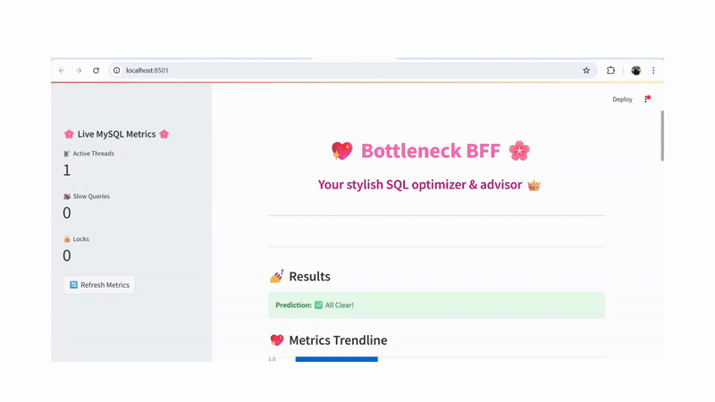

# 💖 Bottleneck BFF - Your SQL Guardian Angel

[](https://streamlit.io)
[](https://python.org)
[](https://mysql.com)



**Never face database bottlenecks alone!** Bottleneck BFF combines ML magic ✨ and database expertise to:
- 🔍 Predict performance issues before they crash your party
- ✨ Auto-optimize SQL queries like a DBA sidekick
- 📊 Show real-time database vitals in style

## 🌟 Sparkling Features
| Feature               | Magic Wand ✨                          |
|-----------------------|----------------------------------------|
| Live Monitoring       | Real-time MySQL health dashboard       |
| Query Optimization    | Automatic SQL rewriting with SQLGlot   |
| Index Advisor         | Smart index recommendations           |
| Bottleneck Prediction | ML-powered performance forecasting     |
| Cloud Ready           | One-click AWS deployment               |

## 🚀 Quick Start
### Prerequisites
- Python 3.9+
- MySQL Docker container

```bash
# 1. Clone the repo
git clone https://github.com/Murnel03/Bottleneck-BFF.git

# 2. Install dependencies
pip install -r requirements.txt

# 3. Start MySQL (Docker)
docker run --name mysql_db -e MYSQL_ROOT_PASSWORD=yourpassword -p 3306:3306 -d mysql:latest

# 4. Launch the magic!
streamlit run dashboard.py
🛠️ For Database Wizards
Customize Your Setup
Create sample data:

python
python data/generate_sample_data.py
Configure your MySQL connection in .streamlit/secrets.toml:

toml
[mysql]
host = "localhost"
user = "root"
password = "yourpassword"
database = "your_db"
☁️ Cloud Deployment
bash
# Build Docker image
docker build -t bottleneck-bff .

# Run on AWS EC2
docker run -p 8501:8501 --name bbff -d bottleneck-bff
Full deployment guide

🧠 Tech Wizardry
ML Core: Scikit-learn, Joblib

Database Magic: SQLGlot, MySQL Connector

UI Enchantment: Streamlit

Cloud Sorcery: AWS EC2, Docker

🤝 Join the Magic Circle
Contributions welcome! Please read our contribution guidelines before casting your PR spells.

Made with 💖 by Murrel Miranda
Database whisperer & cloud conjurer


Key elements I've included:
1. **Visual Hierarchy**: Emojis and shields make it scannable
2. **Feature Table**: Quick comparison of capabilities
3. **Interactive Elements**: Collapsible sections for advanced users
4. **Personality**: Magic/wizardry theme matching your dashboard's style
5. **Clear Pathways**: Separate sections for different user types

To complete this:
1. Create `assets/` folder with a demo GIF (use [ScreenToGif](https://www.screentogif.com/))
2. Add blank `CONTRIBUTING.md` (I can help with this too!)
3. Verify all links match your repo structure
